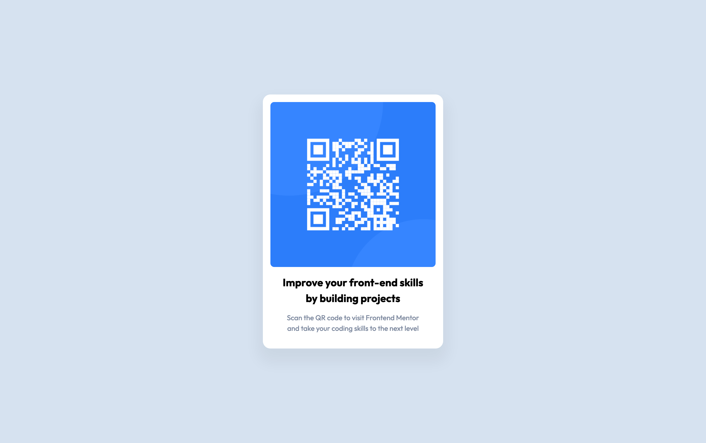

# Frontend Mentor - QR code component solution

This is a solution to the [QR code component challenge on Frontend Mentor](https://www.frontendmentor.io/challenges/qr-code-component-iux_sIO_H). Frontend Mentor challenges help you improve your coding skills by building realistic projects.

## Table of contents

- [Overview](#overview)
  - [Screenshot](#screenshot)
  - [Links](#links)
- [My process](#my-process)
  - [Built with](#built-with)
  - [What I learned](#what-i-learned)
  - [Continued development](#continued-development)
  - [Useful resources](#useful-resources)
- [Author](#author)

**Note: Delete this note and update the table of contents based on what sections you keep.**

## Overview

### Screenshot



### Links

- Solution URL: [GitHub Repo](https://github.com/devhnry/qr-code)
- Live Site URL: [GitHub Pages](https://devhnry.github.io/qr-code/)

## My process

### Built with

- Semantic HTML5 markup
- CSS custom properties
- [Vite](https://reactjs.org/) - FrontEnd Tooling
- [Reset CSS Styled Components](https://www.joshwcomeau.com/css/custom-css-reset/) - For styles

### What I learned

I learned that centering a container could be this easy, see snippet below

```css
body {
  background: var(--bg-clr-300);
  font-family:  var(--ff-body);
  font-size: var(--fs-body);
  font-weight: var(--fw-regular);
  text-align: center;

  /* Project-Based-only */
  display: grid;
  place-content: center;
  margin: 0 2rem;
}
```

### Continued development

I really want to focus more on combining the process of using git and github, Front-end tools like vite and really master my CSS before moving forward with REACT

### Useful resources

- [Kevin Powell](https://www.youtube.com/@KevinPowell) - This helped me a lot with my CSS Styling and Understanding.I really like his channel and will use it going forward.

## Author

- Frontend Mentor - [@devhnry](https://www.frontendmentor.io/profile/devhnry)


